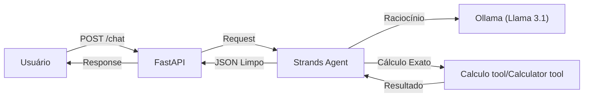
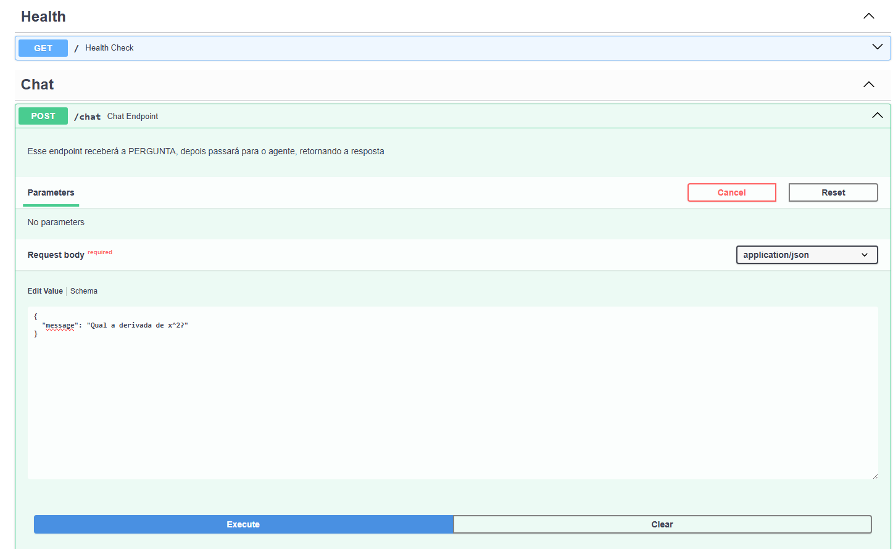
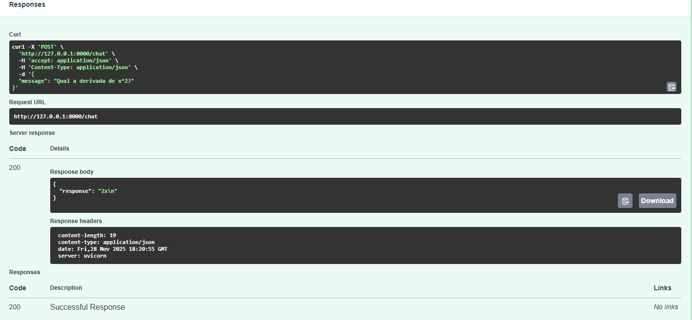
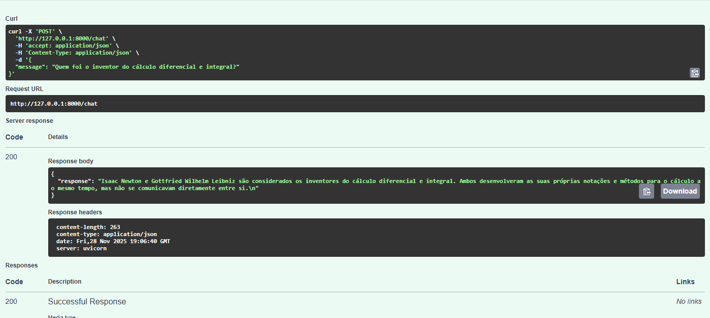

# Desafio Técnico - Vaga de Estágio em IA

> API de um Chat que usa um Agente de IA capaz de orquestrar raciocínio via LLM localmente e executar cálculos matemáticos através de tools 

## Arquitetura Da Solução Desenvolvida:

O programa adota uma arquitetura modular baseada no Agente. 
O Agente atua como um "orquestrador" que decide autonomamente quando utilizar ferramentas de cálculo ou quando responder utilizando seu próprio conhecimento de treinamento.




## Uso
Para conseguir executar o projeto, você precisa ter o Ollama instalado e o Python 3.10+ (execução local) ou Docker (container)

1. Configuração do modelo:

```bash
ollama pull llama3.1
```

2. Instalação local:

```bash
# Clone o repositório

git clone https://github.com/Makonmm/teste-tecnico
cd teste-tecnico

# Crie o ambiente virtual e ative
# Windows:

python -m venv .venv
.venv\Scripts\activate

# Linux ou Mac:

python3 -m venv .venv
source .venv/bin/activate

# Instale as dependências do projeto

pip install -r requirements.txt

# Crie um arquivo .env com o seguinte conteúdo:

PORT=8000
HOST=0.0.0.0
OLLAMA_HOST=http://localhost:11434
OLLAMA_MODEL=llama3.1
USE_CUSTOM_TOOLS=true

```


```bash

3. Execução

# Inicia a API (projeto)

python manage.py api

# Esse comando apenas roda um teste para verificar se o agente está respondendo corretamente

python manage.py test

```

## Execução via Docker (Opcional)


### 1. Buildando a Imagem

No terminal (na raiz do projeto):

```bash
docker build -t agente-ia-api .
# Se for ambiente windows, rode:
docker run -d -p 8000:8000 --name meu-agente \
  -e OLLAMA_HOST="[http://host.docker.internal:11434](http://host.docker.internal:11434)" \
  agente-ia-api

# Caso seja Linux, rode:

docker run -d --network host --name meu-agente \
  -e OLLAMA_HOST="http://localhost:11434" \
  agente-ia-api

```
## Imagens


